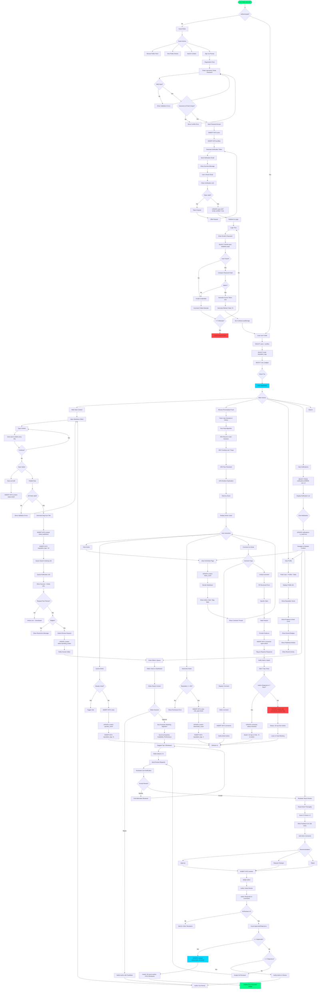

```mermaid
graph TB
    Start([User Visits vero.com]) --> CheckAuth{Authenticated?}

    CheckAuth -->|No| GuestMode[Guest Mode]
    CheckAuth -->|Yes| LoadProfile[Load User Profile]

    GuestMode --> GuestActions{Guest Actions}
    GuestActions --> BrowseFeed[Browse Public Feed]
    GuestActions --> ViewArticle[View Public Articles]
    GuestActions --> SearchContent[Search Content]
    GuestActions --> SignUpPrompt[Sign Up Prompt]

    SignUpPrompt --> RegisterFlow[Registration Flow]

    RegisterFlow --> EnterDetails[Enter Username, Email, Password]
    EnterDetails --> ValidateInput{Valid Input?}
    ValidateInput -->|No| ShowErrors[Show Validation Errors]
    ShowErrors --> EnterDetails
    ValidateInput -->|Yes| CheckUnique{Username & Email Unique?}

    CheckUnique -->|No| ShowConflict[Show Conflict Error]
    ShowConflict --> EnterDetails
    CheckUnique -->|Yes| HashPassword[Hash Password bcrypt]

    HashPassword --> CreateUser[INSERT INTO users]
    CreateUser --> CreateProfile[INSERT INTO profiles]
    CreateProfile --> GenerateToken[Generate Verification Token]
    GenerateToken --> SendEmail[Send Verification Email]
    SendEmail --> ShowSuccess[Show Success Message]

    ShowSuccess --> WaitVerification[User Checks Email]
    WaitVerification --> ClickLink[Clicks Verification Link]
    ClickLink --> ValidateToken{Token Valid?}

    ValidateToken -->|No| TokenExpired[Token Expired]
    TokenExpired --> ResendOption[Offer Resend]
    ResendOption --> GenerateToken
    ValidateToken -->|Yes| MarkVerified[UPDATE users SET email_verified = true]

    MarkVerified --> LoginPrompt[Redirect to Login]
    LoginPrompt --> LoginFlow[Login Flow]

    LoginFlow --> EnterCreds[Enter Email & Password]
    EnterCreds --> FindUser[SELECT FROM users WHERE email]
    FindUser --> UserExists{User Found?}

    UserExists -->|No| InvalidCreds[Invalid Credentials]
    UserExists -->|Yes| CompareHash[Compare Password Hash]
    CompareHash --> PasswordMatch{Match?}

    PasswordMatch -->|No| InvalidCreds
    InvalidCreds --> IncrementFailed[Increment Failed Attempts]
    IncrementFailed --> CheckLockout{>= 5 Attempts?}
    CheckLockout -->|Yes| LockAccount[Lock Account 15 min]
    CheckLockout -->|No| LoginFlow

    PasswordMatch -->|Yes| GenerateJWT[Generate Access Token 15m]
    GenerateJWT --> GenerateRefresh[Generate Refresh Token 7d]
    GenerateRefresh --> SetCookies[Set Cookies/LocalStorage]
    SetCookies --> LoadProfile

    LoadProfile --> FetchUserData[SELECT users + profiles]
    FetchUserData --> FetchReputation[SELECT SUM reputation_logs]
    FetchReputation --> FetchBadges[SELECT user_badges]
    FetchBadges --> CheckTier{Check Tier}

    CheckTier --> Dashboard[User Dashboard]

    Dashboard --> MainActions{Main Actions}

    MainActions --> WriteContent[Write New Content]
    MainActions --> BrowsePersonalFeed[Browse Personalized Feed]
    MainActions --> ViewProfile[View Profile]
    MainActions --> Notifications[View Notifications]
    MainActions --> SearchAction[Search]

    WriteContent --> EditorPage[Open Markdown Editor]
    EditorPage --> TypeContent[Type Content]
    TypeContent --> AutoSave[Auto-save to drafts every 30s]
    AutoSave --> ContinueTyping{Continue?}
    ContinueTyping -->|Yes| TypeContent
    ContinueTyping -->|No| SaveOptions{Save Option}

    SaveOptions --> SaveDraft[Save as Draft]
    SaveOptions --> PublishNow[Publish Now]

    SaveDraft --> StoreDraft[INSERT INTO content status=draft]
    PublishNow --> ValidateContent{All Fields Valid?}

    ValidateContent -->|No| ShowValidation[Show Validation Errors]
    ShowValidation --> EditorPage
    ValidateContent -->|Yes| GenerateSlug[Generate Slug from Title]

    GenerateSlug --> InsertContent[INSERT INTO content status=published]
    InsertContent --> AwardPoints[INSERT INTO reputation_logs +10]
    AwardPoints --> IndexSearch[Queue Search Indexing Job]
    IndexSearch --> NotifyFollowers[Queue Notification Job]
    NotifyFollowers --> ShowPublished[Show Success + Article URL]

    ShowPublished --> AskReview{Request Peer Review?}
    AskReview -->|No| ArticleLive[Article Live - Unreviewed]
    AskReview -->|Yes| CheckEligible{Eligible?}

    CheckEligible -->|No| ShowRestriction[Show Restriction Message]
    CheckEligible -->|Yes| SubmitReview[Submit Review Request]
    SubmitReview --> UpdateStatus[UPDATE content status=pending_review]
    UpdateStatus --> NotifyEditor[Notify Domain Editor]
    NotifyEditor --> EditorQueue[Enter Editor's Queue]

    EditorQueue --> EditorTriages[Editor Views in Dashboard]
    EditorTriages --> EditorReads[Editor Reads Content]
    EditorReads --> EditorDecision{Editor Decision}

    EditorDecision -->|Reject| NotifyRejection[Notify Author with Feedback]
    NotifyRejection --> AuthorRevises[Author Can Revise]
    AuthorRevises --> EditorPage

    EditorDecision -->|Approve| FindReviewers[Run Reviewer Matching Algorithm]
    FindReviewers --> ScoreReviewers[Score by Expertise, Availability, Performance]
    ScoreReviewers --> SuggestTop3[Suggest Top 3 Reviewers]
    SuggestTop3 --> EditorSelects[Editor Selects 2-3]
    EditorSelects --> SendReviewRequests[Send Review Requests]

    SendReviewRequests --> ReviewerNotif[Reviewers Get Notification]
    ReviewerNotif --> ReviewerDecision{Accept Review?}

    ReviewerDecision -->|Decline| FindAlternative[Find Alternative Reviewer]
    FindAlternative --> SuggestTop3
    ReviewerDecision -->|Accept| StartReview[Reviewer Starts Review]

    StartReview --> ReadArticle[Read Article Thoroughly]
    ReadArticle --> ScoreCriteria[Score 5 Criteria 1-5]
    ScoreCriteria --> WriteFeedback[Write Feedback min 200 chars]
    WriteFeedback --> AddComments[Add Inline Comments]
    AddComments --> MakeRecommendation{Recommendation}

    MakeRecommendation --> ApproveReview[Approve]
    MakeRecommendation --> RequestChanges[Request Changes]
    MakeRecommendation --> RejectReview[Reject]

    ApproveReview --> SubmitReview2[INSERT INTO reviews]
    RequestChanges --> SubmitReview2
    RejectReview --> SubmitReview2

    SubmitReview2 --> NotifyAuthor[Notify Author]
    NotifyAuthor --> AuthorViews[Author Views Review]
    AuthorViews --> AuthorResponds[Author Responds to Comments]
    AuthorResponds --> CheckAllReviews{All Reviews In?}

    CheckAllReviews -->|No| WaitMore[Wait for Other Reviewers]
    CheckAllReviews -->|Yes| CountVotes[Count Approvals/Rejections]

    CountVotes --> TwoApprove{>= 2 Approvals?}
    TwoApprove -->|Yes| AwardBadge[UPDATE content status=peer_reviewed]
    TwoApprove -->|No| TwoReject{>= 2 Rejections?}

    AwardBadge --> AwardRepPoints[Award +50 rep to Author, +30 to Reviewers]
    AwardRepPoints --> ShowBadge[Display Peer Reviewed Badge]

    TwoReject -->|Yes| NotifyRevise[Notify Author to Revise]
    NotifyRevise --> AuthorRevises
    TwoReject -->|No| AssignTiebreaker[Assign 3rd Reviewer]
    AssignTiebreaker --> SendReviewRequests

    BrowsePersonalFeed --> FetchUserPrefs[Fetch User Domains & History]
    FetchUserPrefs --> RunFeedAlgo[Run Feed Algorithm]
    RunFeedAlgo --> Mix40Recent[40% Recent in User Domains]
    Mix40Recent --> Mix30Trending[30% Trending Last 7 Days]
    Mix30Trending --> Mix20Reviewed[20% Peer Reviewed]
    Mix20Reviewed --> Mix10Random[10% Random Exploration]
    Mix10Random --> RankByScore[Rank by Score]
    RankByScore --> DisplayFeed[Display Article Cards]

    DisplayFeed --> UserInteracts{User Interaction}

    UserInteracts --> ClickArticle[Click Article]
    UserInteracts --> UpvoteArticle[Upvote Article]
    UserInteracts --> DownvoteArticle[Downvote Article]
    UserInteracts --> CommentOnArticle[Comment on Article]

    ClickArticle --> ViewFullArticle[View Full Article Page]
    ViewFullArticle --> IncrementViews[UPDATE content views_count]
    IncrementViews --> ShowContent[Render Markdown]
    ShowContent --> ShowMeta[Show Author, Date, Tags, Stats]
    ShowMeta --> ShowComments[Show Comment Thread]
    ShowComments --> UserInteracts

    UpvoteArticle --> CheckVoted{Already Voted?}
    CheckVoted -->|Yes| ToggleVote[Toggle Vote]
    CheckVoted -->|No| InsertVote[INSERT INTO votes]
    InsertVote --> UpdateCount[UPDATE content upvotes_count]
    UpdateCount --> AwardAuthorRep[INSERT INTO reputation_logs +5]
    AwardAuthorRep --> RefreshUI[Refresh UI]

    DownvoteArticle --> CheckCanDownvote{Reputation >= 150?}
    CheckCanDownvote -->|No| ShowError[Show Permission Error]
    CheckCanDownvote -->|Yes| InsertDownvote[INSERT INTO votes vote_type=down]
    InsertDownvote --> UpdateDownCount[UPDATE content downvotes_count]
    UpdateDownCount --> DeductRep[INSERT INTO reputation_logs -2]
    DeductRep --> RefreshUI

    CommentOnArticle --> SelectType{Comment Type}
    SelectType --> RegularComment[Regular Comment]
    SelectType --> CriticalComment[Critical Comment]

    RegularComment --> WriteComment[Write Comment]
    WriteComment --> InsertComment[INSERT INTO comments]
    InsertComment --> NotifyAuthorComment[Notify Article Author]
    NotifyAuthorComment --> RefreshUI

    CriticalComment --> StructuredForm[Fill Structured Form]
    StructuredForm --> Claim[Specify Claim]
    Claim --> Reason[State Reason]
    Reason --> Evidence[Provide Evidence]
    Evidence --> InsertCritical[INSERT INTO comments type=critical]
    InsertCritical --> SetFlag[Flag as Requires Response]
    SetFlag --> NotifyAuthorUrgent[Notify Author Urgent]
    NotifyAuthorUrgent --> Start7DayTimer[Start 7 Day Timer]

    Start7DayTimer --> CheckResponse{Author Responds in 7 Days?}
    CheckResponse -->|Yes| MarkResolved[UPDATE comments status=resolved]
    MarkResolved --> AwardCriticRep[Award +10 rep to Critic, +5 to Author]
    AwardCriticRep --> RefreshUI

    CheckResponse -->|No| FlagUnresolved[UPDATE content add unresolved_criticism flag]
    FlagUnresolved --> DeductAuthorRep[Deduct -20 rep from Author]
    DeductAuthorRep --> LowerVisibility[Lower in Feed Ranking]
    LowerVisibility --> RefreshUI

    ViewProfile --> FetchProfileData[Fetch User + Profile + Stats]
    FetchProfileData --> DisplayProfile[Display Profile Info]
    DisplayProfile --> ShowReputation[Show Reputation Score]
    ShowReputation --> ShowProgress[Show Progress to Next Level]
    ShowProgress --> ShowBadges[Show Earned Badges]
    ShowBadges --> ShowArticles[Show Published Articles]
    ShowArticles --> ShowActivity[Show Recent Activity]

    Notifications --> FetchNotifs[SELECT FROM notifications WHERE user_id]
    FetchNotifs --> DisplayNotifs[Display Notification List]
    DisplayNotifs --> ClickNotif{Click Notification}
    ClickNotif --> MarkRead[UPDATE notifications is_read=true]
    MarkRead --> Navigate[Navigate to Related Content]

    Navigate --> ViewFullArticle
    Navigate --> EditorQueue
    Navigate --> ViewProfile
    Navigate --> StartReview

    style Start fill:#00ff88
    style Dashboard fill:#00d9ff
    style AwardBadge fill:#00d9ff
    style ShowBadge fill:#00ff88
    style FlagUnresolved fill:#ff4444
    style LockAccount fill:#ff4444
```
