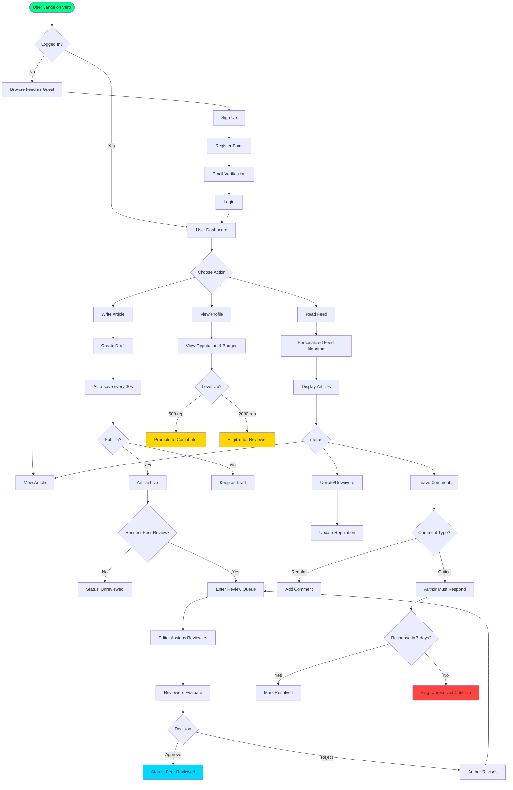

```mermaid
graph TD
    Start([User Lands on Vero]) --> Guest{Logged In?}
    Guest -->|No| Browse[Browse Feed as Guest]
    Guest -->|Yes| Dashboard[User Dashboard]
    
    Browse --> ViewArticle[View Article]
    Browse --> SignUp[Sign Up]
    
    SignUp --> Register[Register Form]
    Register --> VerifyEmail[Email Verification]
    VerifyEmail --> Login[Login]
    
    Login --> Dashboard
    
    Dashboard --> Actions{Choose Action}
    
    Actions --> Write[Write Article]
    Actions --> Read[Read Feed]
    Actions --> Profile[View Profile]
    
    Write --> Draft[Create Draft]
    Draft --> AutoSave[Auto-save every 30s]
    AutoSave --> Publish{Publish?}
    Publish -->|Yes| Live[Article Live]
    Publish -->|No| SaveDraft[Keep as Draft]
    
    Live --> RequestReview{Request Peer Review?}
    RequestReview -->|No| Unreviewed[Status: Unreviewed]
    RequestReview -->|Yes| ReviewQueue[Enter Review Queue]
    
    ReviewQueue --> AssignReviewer[Editor Assigns Reviewers]
    AssignReviewer --> ReviewProcess[Reviewers Evaluate]
    ReviewProcess --> ReviewDecision{Decision}
    
    ReviewDecision -->|Approve| PeerReviewed[Status: Peer Reviewed]
    ReviewDecision -->|Reject| Revise[Author Revises]
    Revise --> ReviewQueue
    
    Read --> FeedAlgo[Personalized Feed Algorithm]
    FeedAlgo --> ShowArticles[Display Articles]
    ShowArticles --> Interact{Interact}
    
    Interact --> Vote[Upvote/Downvote]
    Interact --> Comment[Leave Comment]
    Interact --> ViewArticle
    
    Vote --> UpdateRep[Update Reputation]
    Comment --> CheckType{Comment Type?}
    
    CheckType -->|Regular| AddComment[Add Comment]
    CheckType -->|Critical| RequireResponse[Author Must Respond]
    
    RequireResponse --> AuthorRespond{Response in 7 days?}
    AuthorRespond -->|Yes| Resolve[Mark Resolved]
    AuthorRespond -->|No| Flag[Flag: Unresolved Criticism]
    
    Profile --> ViewStats[View Reputation & Badges]
    ViewStats --> CheckLevel{Level Up?}
    CheckLevel -->|500 rep| Contributor[Promote to Contributor]
    CheckLevel -->|2000 rep| EligibleReviewer[Eligible for Reviewer]
    
    style Start fill:#00ff88
    style PeerReviewed fill:#00d9ff
    style Flag fill:#ff4444
    style Contributor fill:#ffd700
    style EligibleReviewer fill:#ffd700
```